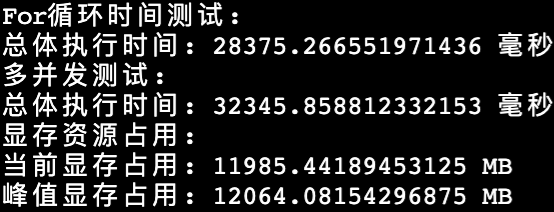
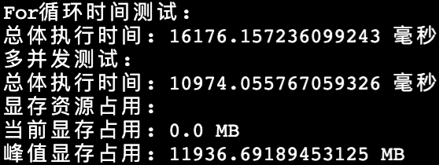

# ChatGLM2-6B模型以及FastLLM评估

> 本周主要进行了针对模型的性能评估，测试了ChatGLM2-6B原始版本和FastLLM版本的模型在For循环时间测试、多并发测试和显存资源占用方面的表现
> 

# GPU信息

GPU: Autodel 平台 NVIDIA GeForce RTX 3090

```c
+-----------------------------------------------------------------------------+
| NVIDIA-SMI 525.89.02    Driver Version: 525.89.02    CUDA Version: 12.0     |
|-------------------------------+----------------------+----------------------+
| GPU  Name        Persistence-M| Bus-Id        Disp.A | Volatile Uncorr. ECC |
| Fan  Temp  Perf  Pwr:Usage/Cap|         Memory-Usage | GPU-Util  Compute M. |
|                               |                      |               MIG M. |
|===============================+======================+======================|
|   0  NVIDIA GeForce ...  On   | 00000000:56:00.0 Off |                  N/A |
| 30%   27C    P8    17W / 350W |      0MiB / 24576MiB |      0%      Default |
|                               |                      |                  N/A |
+-------------------------------+----------------------+----------------------+
                                                                               
+-----------------------------------------------------------------------------+
| Processes:                                                                  |
|  GPU   GI   CI        PID   Type   Process name                  GPU Memory |
|        ID   ID                                                   Usage      |
|=============================================================================|
|  No running processes found                                                 |
+-----------------------------------------------------------------------------+
```

CPU: Autodel 平台 14 vCPU Intel(R) Xeon(R) Gold 6330 CPU @ 2.00GHz

```c
Architecture:                    x86_64
CPU op-mode(s):                  32-bit, 64-bit
Byte Order:                      Little Endian
Address sizes:                   46 bits physical, 57 bits virtual
CPU(s):                          112
On-line CPU(s) list:             0-111
Thread(s) per core:              2
Core(s) per socket:              28
Socket(s):                       2
NUMA node(s):                    2
Vendor ID:                       GenuineIntel
CPU family:                      6
Model:                           106
Model name:                      Intel(R) Xeon(R) Gold 6330 CPU @ 2.00GHz
Stepping:                        6
Frequency boost:                 enabled
CPU MHz:                         878.353
CPU max MHz:                     3100.0000
CPU min MHz:                     800.0000
BogoMIPS:                        4000.00
Virtualization:                  VT-x
L1d cache:                       2.6 MiB
L1i cache:                       1.8 MiB
L2 cache:                        70 MiB
L3 cache:                        84 MiB
```

---

# 原版模型评估测试

### 测试代码

```python
import torch
from transformers import AutoTokenizer, AutoModel
from concurrent.futures import ThreadPoolExecutor
import time

tokenizer = AutoTokenizer.from_pretrained("THUDM/chatglm2-6b", trust_remote_code=True)
model = AutoModel.from_pretrained("./chatglm2-6b", trust_remote_code=True, device='cuda')
model = model.eval()

# 输入示例
queries = [
    "标题:“涉卡”罪名汇总 问题: “涉卡”罪名有哪些",
    "标题:关于应用分身提取。 问题: 应用分发怎么提取",
    "标题:优酷 问题: 优酷的地址是哪里？",
    "标题:网宿科技调证 问题: 网宿科技如何调证",
    "标题:对公账户如何查询？ 问题: 对公账户怎么查询",
]

# For循环时间测试
start_time = time.time()
for query in queries:
    response, _ = model.chat(tokenizer, query)
end_time = time.time()

elapsed_time_ms = (end_time - start_time) * 1000
print("For循环时间测试:")
print("总体执行时间:", elapsed_time_ms, "毫秒")

# 多并发测试
def run_inference(query):
    response, _ = model.chat(tokenizer, query)
    return response

executor = ThreadPoolExecutor()

start_time = time.time()
future_results = [executor.submit(run_inference, query) for query in queries]
results = [future.result() for future in future_results]
end_time = time.time()

elapsed_time_ms = (end_time - start_time) * 1000
print("多并发测试:")
print("总体执行时间:", elapsed_time_ms, "毫秒")

executor.shutdown()

# 显存资源占用评估
allocated_memory = torch.cuda.memory_allocated()
max_allocated_memory = torch.cuda.max_memory_allocated()

print("显存资源占用:")
print("当前显存占用:", allocated_memory / 1024 ** 2, "MB")
print("峰值显存占用:", max_allocated_memory / 1024 ** 2, "MB")
```

### 测试结果



# FastLLM加速推理评估测试

### 测试代码

```python
import torch
from transformers import AutoTokenizer, AutoModel
from concurrent.futures import ThreadPoolExecutor
import time

tokenizer = AutoTokenizer.from_pretrained("THUDM/chatglm2-6b", trust_remote_code=True)
model = AutoModel.from_pretrained("./chatglm2-6b", trust_remote_code=True, device='cuda')
model = model.eval()
from fastllm_pytools import llm
model = llm.from_hf(model, tokenizer, dtype = "float16")

# 输入示例
queries = [
    "标题:“涉卡”罪名汇总 问题: “涉卡”罪名有哪些",
    "标题:关于应用分身提取。 问题: 应用分发怎么提取",
    "标题:优酷 问题: 优酷的地址是哪里？",
    "标题:网宿科技调证 问题: 网宿科技如何调证",
    "标题:对公账户如何查询？ 问题: 对公账户怎么查询",
]

# For循环时间测试
start_time = time.time()
for query in queries:
    response = model.response(query)
end_time = time.time()

elapsed_time_ms = (end_time - start_time) * 1000
print("For循环时间测试:")
print("总体执行时间:", elapsed_time_ms, "毫秒")

# 多并发测试
def run_inference(query):
    response = model.response(query)
    return response

executor = ThreadPoolExecutor()

start_time = time.time()
future_results = [executor.submit(run_inference, query) for query in queries]
results = [future.result() for future in future_results]
end_time = time.time()

elapsed_time_ms = (end_time - start_time) * 1000
print("多并发测试:")
print("总体执行时间:", elapsed_time_ms, "毫秒")

executor.shutdown()

# 显存资源占用评估
allocated_memory = torch.cuda.memory_allocated()
max_allocated_memory = torch.cuda.max_memory_allocated()

print("显存资源占用:")
print("当前显存占用:", allocated_memory / 1024 ** 2, "MB")
print("峰值显存占用:", max_allocated_memory / 1024 ** 2, "MB")
```

### 测试结果



---

# 分析

### For循环时间测试

在原始版本中，对于给定的查询列表，我使用For循环依次调用模型的**`chat()`**方法进行推理，总体执行时间为28375.27毫秒。

在FastLLM版本中，当使用**`model.response()`**方法进行推理，并且使用FastLLM进行加速。结果显示，总体执行时间缩短为16176.16毫秒。

可以看出FastLLM在For循环时间测试中有更好的性能，加速了模型的推理过程。

### 多并发测试

在原始版本中，我使用**`ThreadPoolExecutor`**创建线程池执行器，同时提交多个并发任务，总体执行时间为32345.86毫秒。

在FastLLM版本中，同样使用线程池执行器并提交多个并发任务，但使用**`model.response()`**方法进行推理。总体执行时间缩短为10974.06毫秒。

同样可以看出FastLLM在多并发测试中表现出更好的性能，提高了并发推理的效率。

### 资源占用测试

原始版本和FastLLM版本的显存占用情况有所不同

在原始版本中，当前显存占用为11985.44MB，峰值显存占用为12064.08MB。

在FastLLM版本中，当前显存占用为0.0MB，峰值显存占用为11936.69MB。FastLLM在此项效果稍好，使用的显存略微较低。

> 我注意到FastLLM的当前显存占用为0.0MB，这可能是因为在FastLLM中，模型参数被转换为了**`float16`**类型的数据。这可能导致在调用**`torch.cuda.memory_allocated()`**时无法准确获取当前显存占用。
>
> 由于FastLLM对模型内部做了一些改动，我还没有分析其代码具体实现细节，但可以推测FastLLM在转换过程中可能使用了压缩算法或精度降低的技术。
>
> 但根据峰值参考，我认为FastLLM版本在显存占用与原始版本的区别在运行误差范围内，其在资源占用方面不存在明显优化。


### 总结和不足

总体而言，FastLLM在模型的推理性能方面展现出了较好的优势。

需要注意的是，本测试只关注于模型的响应结果和空间的评估。我在搜索时发现，一般在评估模型性能时，通常只关注推理的时间和资源消耗，而不需要计算梯度。

但我在这次测试中并没有禁用梯度计算，这是因为我在进行fastllm测试中，在运行以下代码时

```python
import torch
from transformers import AutoTokenizer, AutoModel
from fastllm_pytools import llm
import time
tokenizer = AutoTokenizer.from_pretrained("THUDM/chatglm2-6b", trust_remote_code=True)
model = AutoModel.from_pretrained("THUDM/chatglm2-6b", trust_remote_code=True)
model = llm.from_hf(model, tokenizer, dtype="float16")
query_text = "你好"
input_ids = tokenizer.encode(query_text, add_special_tokens=True, return_tensors='pt')
with torch.no_grad():
    model(input_ids)
```

我发现使用**`torch.no_grad()`**会报错，我在尝试各种方法仍无法解决后选择放弃。

由于没有没有禁用梯度计算，测试结果可能没有准确评估模型的推理时间和空间消耗，但仍然通过对比测试发现FastLLM在推理速度方面具有明显优势。